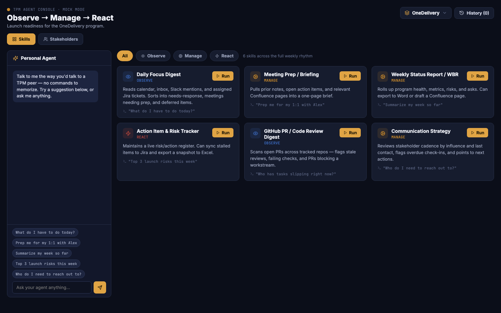
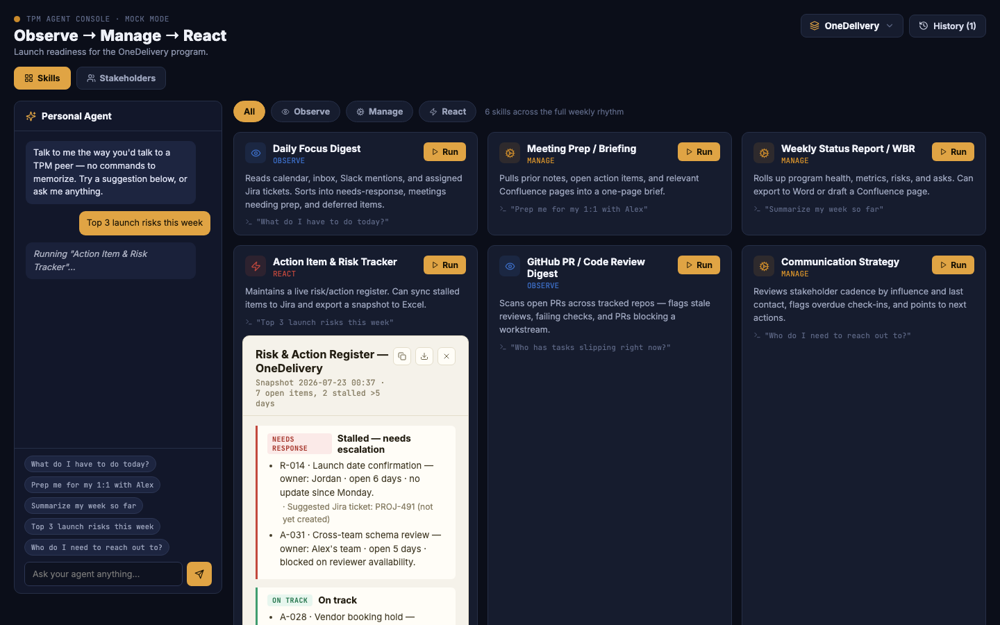
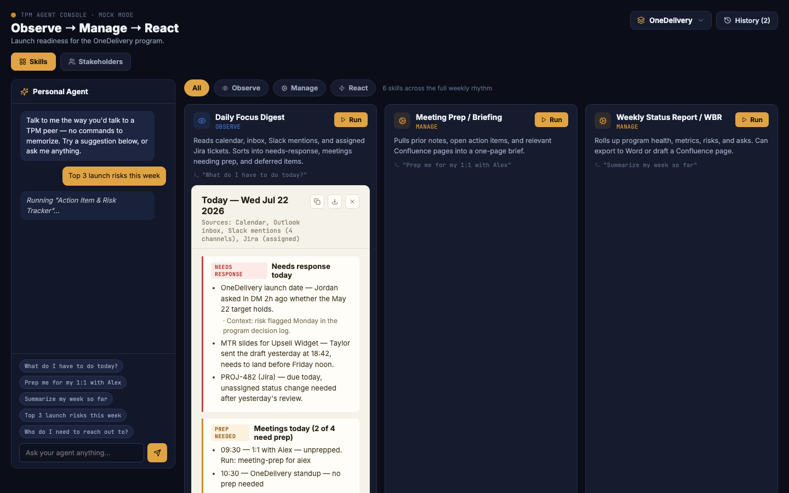

# TPM Agent

A personal automation layer for the repeatable parts of the TPM role — Observe
(gather) and Manage (synthesize) — so more of the week is left for React
(the parts that actually need a human: escalation, negotiation, decisions).

This repo has two things in it: a real web app (`webapp/`) — a console UI
wired to a real backend — and the skill/agent layer (`skills/`, `agents/`,
`mcp/`) that both the web app and a future CLI share. Seven MCP servers
are configured — GitHub, Slack, Microsoft 365 (Outlook/Calendar/SharePoint
/cloud Excel), Atlassian (Jira/Confluence), local Excel, local Word, and a
persistent memory store.

## Screenshots

The web app running locally in mock mode — zero credentials required.

**Dashboard** — skill cards grouped by Observe / Manage / React, program
switcher, and the personal-agent chat rail with suggested prompts.



**Chat-triggered skill run** — typing (or clicking) a suggestion routes
to the matching skill and renders its output inline as a card.



**Daily Focus Digest output** — a skill run from its card, showing the
needs-response / prep-needed breakdown with source attribution.



## Programs

Everything — skills, run history, stakeholders — is scoped under a
**Program**: a TPM works several programs at once, and switching the
active program switches the whole context underneath it, not just a
filter on top of shared data. The web app has a program switcher in the
header; in the conversational/CLI path, say which program you mean if
it's ambiguous.

Two skills are program-specific in a different way than the original
five — they're not "run it, get a digest" so much as persistent state
the other skills read from:
- **`stakeholder-mapping`** — who's involved, their influence/interest,
  last contact date. A living record, not a dated snapshot.
- **`communication-strategy`** — reads the stakeholder map, flags who's
  overdue for outreach (staleness threshold scales with influence), and
  offers three actions per stakeholder: draft a meeting, draft an email,
  or capture meeting notes. All three are draft-only — see
  `context/steering-identity.md`.

The web app's Stakeholders tab is the reference implementation for both
(`webapp/backend/src/programs.js` and `src/skills/communicationStrategy.js`)
— the two `SKILL.md` files below describe the same behavior for the
conversational/CLI path.

## ⚠️ Before you connect real auth

Several of the source systems this is designed for (internal wiki,
internal ticketing, internal data platforms) are internal company tools.
Before pointing any MCP server at real company data:

1. Check whether your org has a sanctioned AI tooling policy (many
   companies require internal-approved agents for anything touching
   internal systems, and treat unsanctioned CLI+MCP combinations touching
   corp auth as a security review item, not a personal choice).
2. Prefer read-only scopes everywhere a skill only needs to read.
3. Never let a skill auto-send/auto-post without a human confirmation step
   (see `context/steering-identity.md` — this is a hard rule, not a
   suggestion).
4. Keep `output/`, `.env`, and `.mcp.json` (if it contains literal secrets)
   out of version control. See `.gitignore`.

## Layout

```
tpm-agent/
├── webapp/
│   ├── frontend/                ← React console UI
│   │   └── src/components/      ← includes ProgramSwitcher.jsx, StakeholdersPanel.jsx
│   ├── backend/
│   │   ├── data/                ← programs.json: programs + stakeholders (gitignored)
│   │   └── src/                 ← Express API: runs skills, writes output/, serves history
│   └── README.md                ← how to run both, how mock vs real mode works
├── agents/
│   └── tpm-agent.spec.json      ← the WHO: persona, skills, tool bindings, program scope
├── skills/
│   ├── daily-focus-digest/SKILL.md
│   ├── meeting-prep/SKILL.md
│   ├── weekly-status-report/SKILL.md
│   ├── risk-action-tracker/SKILL.md
│   ├── pr-review-digest/SKILL.md
│   ├── stakeholder-mapping/SKILL.md      ← persistent record, not a dated digest
│   └── communication-strategy/SKILL.md   ← reads stakeholder-mapping, offers outreach actions
├── mcp/
│   ├── .mcp.json                ← 7 MCP server registrations (the CLI agent reads this)
│   └── README.md                ← what each server does, how to install/auth it
├── auth/
│   ├── .env.example             ← template, no real secrets
│   └── AUTH.md                  ← how to get each credential, rotation, security notes
├── context/
│   └── steering-identity.md     ← always-on rules loaded every session
├── scripts/
│   └── README.md                ← placeholder for custom bridges (systems with no MCP)
└── output/                      ← dated skill outputs + history.json land here (gitignored)
```

## How a skill runs

Two entry points, same underlying skills:

**Via the CLI agent (conversational):**
1. You ask in plain language ("prep me for my 1:1 with Alex") or invoke
   the skill directly.
2. The agent reads the matching `skills/*/SKILL.md` for when-to-use,
   inputs, and output contract.
3. It calls the MCP tools listed in that skill's Context section.
4. It writes a dated file to `output/<skill-id>-YYYYMMDD.md`.

**Via the web app:**
1. Run `webapp/backend` and `webapp/frontend` (see `webapp/README.md`).
2. Click Run on a skill card, or type into the chat rail — same trigger
   phrases as above.
3. The backend's `webapp/backend/src/skills/*.js` modules mirror the
   `skills/*/SKILL.md` files and write to the same `output/` directory.
4. Starts in mock mode (no credentials needed); flipping to real mode
   means porting each skill's `runReal()` to actually call the MCP
   servers in `mcp/.mcp.json` — see `webapp/README.md` for the build order.

Either way: **nothing gets posted/sent anywhere without you confirming**
— see `context/steering-identity.md`.

## Setup order

1. Fastest way to see it work: `cd webapp/backend && npm install && npm run dev`,
   then `cd webapp/frontend && npm install && npm run dev` — mock mode
   needs zero credentials.
2. `cp auth/.env.example auth/.env` and fill in what you actually have
   access to — you don't need every integration to start.
3. Read `mcp/README.md` and install the servers for the integrations you
   filled in.
4. Read `auth/AUTH.md` for how to get each credential and what scope to
   request.
5. From this directory, run your CLI agent and try: `what do I have to do
   today?` — or flip `MOCK_MODE=false` in `webapp/backend/.env` once
   you've ported a skill's `runReal()`.
6. Start with **one** skill end-to-end (Daily Focus Digest is the smallest
   surface area) before wiring up the rest.

## What's NOT here yet

Internal wiki and internal ticketing/data-platform readers have no public
MCP server — that's a known gap for any internal-only system.
`scripts/README.md` sketches a 3-tier fallback pattern (official API →
browser automation → last-resort scrape) so you can drop in real bridges
later without changing any skill's output contract.
